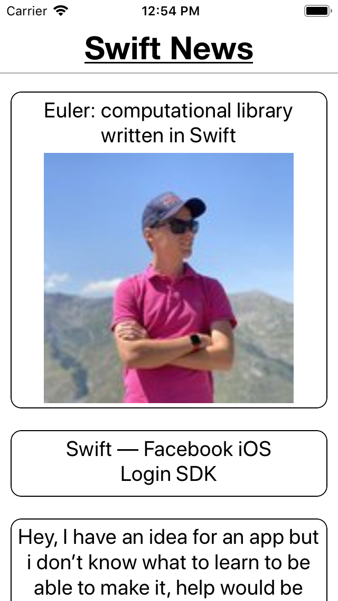

### LobLawTest

It will Display a list of news from API

- The 'main' view displays a list of the news articles. If the article contains a thumbnail image, It will display that image in the cell with the article title on top of the image. If the article doesn't contain an image, just display the article title. The cells sizes are respective with the image, preserving aspect ratio. If the cell is just text, the cell will shrink to the size of the title. This 'main' view controller is inside the navigation controller, with the title "Swift News".

- Once we can scroll a list of articles, we will display the full article in a new view. In the case the article contains a thumbnail image, we'd show that image at the top of the article and article body. If no thumbnail, just article body. There should also be a way to return to the 'main' view. The title of that view will contain the article title.

Acceptance Criteria:
-This application should pull JSON data from the following: https://www.reddit.com/r/swift/.json
-The data should be serialized into some kind of type safe object or objects
-The 'main' view must pass the article 'object' in some way to the 'article view'
-The app should be tested to run on a real iPhone / iPod device- meaning auto-layout works on different size devices as intended and ATS set up correctly and safely
-The codebase should be written entirely using Swift, build for iOS 12.x
-You must upload your completed code to a public GitHub repository and send us the link!

# How to Use

- clone the project repo
- go to terminal -> to to project directory 
- write pod install
- open the .xcworkspace proect
- build and run the project

### Screenshots

